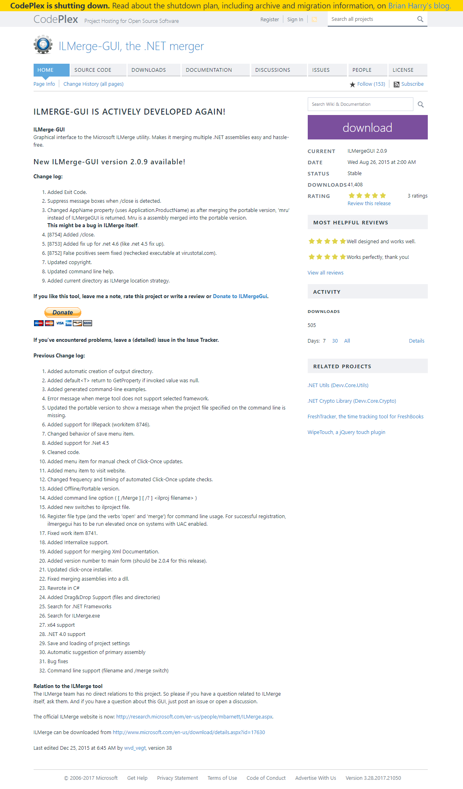

# ILMergeGUI

Cloned from the unmaintained CodePlex project (https://ilmergegui.codeplex.com/).  All credit goes to the 
original authors (see screen capture below).

* Fixed a couple of broken file references
* Disabled signing of the ClickOnce installer (due to a missing .pfx)
* Minor knob twiddling to get the application to build and run
* Tweaked the code to allow it to work with .NET 4.7

The ClickOnce application wouldn't run on my system so I zipped the necessary files and created a release.

## CodePlex Site

